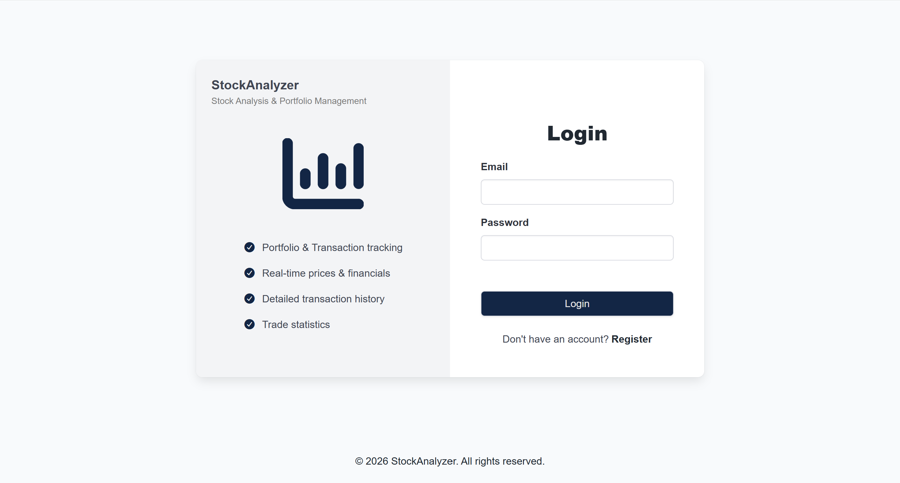
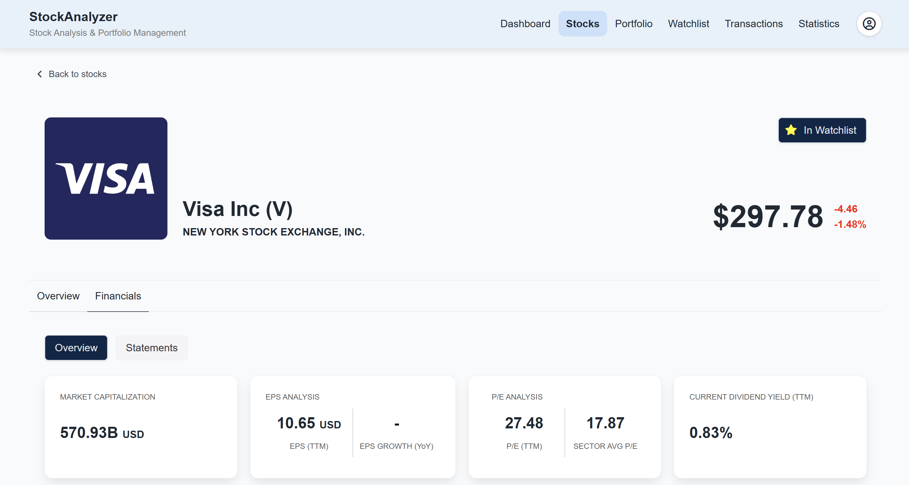
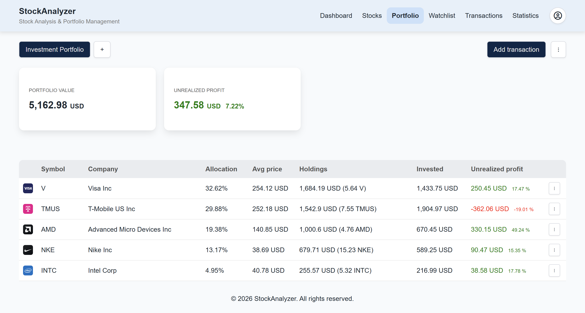
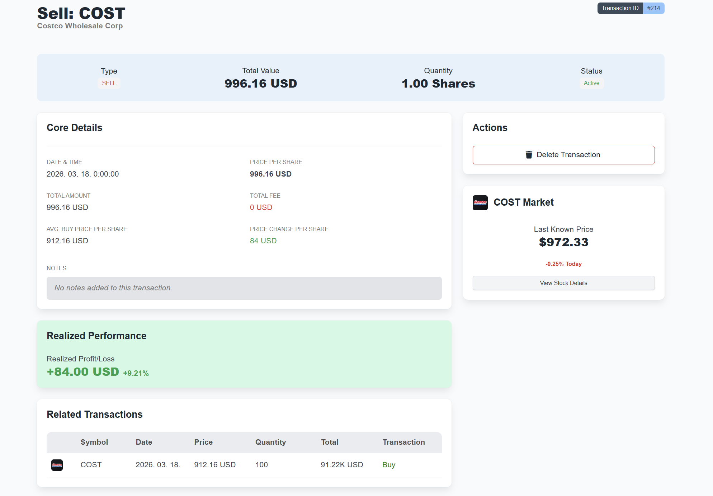
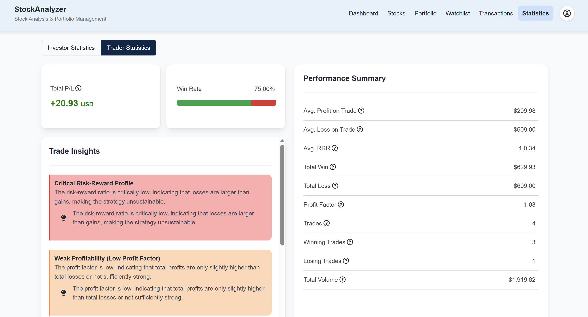

# StockAnalyzer – Stock Analysis & Portfolio Management App

A szoftver célja egy olyan web alapú alkalmazás fejlesztése, amely lehetőséget biztosít a felhasználók számára amerikai részvények fundamentális elemzésére, valamint saját részvényportfólió összeállítására és nyomon követésére. A funkcionalitások közé tartozik továbbá a portfólióban rögzített tranzakciók részletes kiértékelése, ezek alapján statisztikák és teljesítmény-optimalizáló javaslatok generálása.

---

## Technológiai környezet

- Frontend: **React, Bulma**
- Backend: **C# .NET 9 - Entity Framework Core Web API**
- Adatbázis: **SQLite**
- Fejlesztői eszközök: Visual Studio Code, Visual Studio 2022
- Egyéb: **Fetch API**  
	Finnhub.io - https://finnhub.io - Finnhub Stock API
	API Ninjas - https://api-ninjas.com - API Ninjas Stock API

---

## Főbb funkciók

- Részvények böngészése, adatok megtekintése elemzéshez
- Részvényportfólió összeállítása, változások nyomon követése
- Részvény tranzakciók rögzítése
- Portfólió teljesítményének kiértékelése
- Részvény-figyelő lista létrehozása
- Oktatói anyagok megtekintése
- Tranzakció kiértékelések megtekintése
- Részletes teljesítmény statisztika megtekintése

---

## Felhasználói szerepkörök

1. Adminisztrátor szerepkör
Az adminisztrátor szerepkör célja, hogy lehetőséget biztosítson a szoftverben megtalálható oktatói modul kezelésére.

2. Befektető szerepkör
A befektető szerepkör lehetővé teszi a felhasználó számára részvények böngészését, saját portfólió összeállítását és kezelését, valamint a befektetések teljesítményének nyomon követését és elemzését.

---

## Biztonsági megoldások

- JWT token alapú hitelesítés
- Refresh token kezelés
- Jogosultság ellenőrzés
- Jelszó titkosítás

---

## Telepítés és futtatás

A rendszer külső API szolgáltatásokat használ (Finnhub, API Ninjas), ezek működéséhez saját API kulcs megadása szükséges.
Beillesztésük az appsettings.json fájlba szükséges. (a források elérhetősége megtalálható a Technológiai környezet szekcióban)
appsettings.json fájl helye: backend/StockManager/StockManager/appsettings.json

### Backend indítása

Az alkalmazás SQLite adatbázist használ.
A projekt első futtatásakor a migrációk automatikusan létrehozzák az adatbázist.

```bash
cd backend/StockManager/StockManager/
dotnet restore
dotnet ef database update
dotnet run
```

### Frontend indítása
```bash
cd frontend/StockManager
npm install
npm run dev
```

---

## Képernyőképek







---

## Megjegyzés

A projekt elindítható API kulcsok nélkül is, azonban a külső részvényadatok lekérése nem fog működni.
